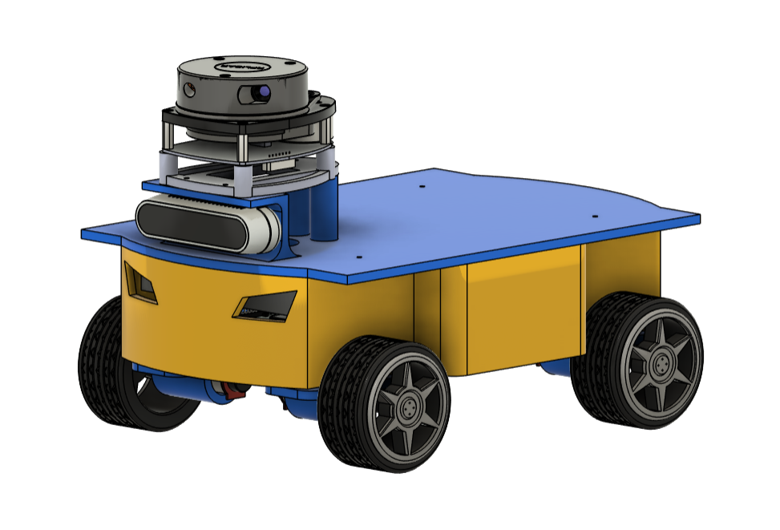

# WareGV: Warehouse Autonomous Ground Vehicle




An autonomous warehouse ground vehicle that uses SLAM and Nav2 to navigate a building and pick up / deliver goods.

Built with **ROS 2 Jazzy**, **Gazebo Harmonic**, **SLAM**, and **Nav2**.

---
## Start Simulation

```bash
./bin/start_simulation.sh --world-name small_warehouse --max-linear-velocity 0.8 --mapping-enable false
```

### Flags

| Flag Name | Expected Value Type | Default Value | Description |
| :--- | :--- | :--- | :--- |
| `--mapping-enable` | `true` / `false` | `true` | Activates SLAM mapping nodes. |
| `--navigation-enable` | `true` / `false` | `true` | Activates Nav2 navigation stack stacks. |
| `--world-name` | `string` | `small_warehouse` | Target Gazebo world file name. |
| `--max-linear-velocity` | `float` | `0.5` | Maximum forward/backward speed limit (m/s). |
| `--max-angular-velocity` | `float` | `3.14159265359` | Maximum rotation speed limit (π rad/s). |
| `--wheel-radius` | `float` | `0.0325` | Radius of the robot differential wheels (meters). |
| `--wheel-base` | `float` | `0.176` | Distance between left and right wheels (meters). |
| `--model` | `string` | `waregv.urdf.xacro` | Target robot URDF description filename. |
| `--spawn-z` | `float` | `0.5` | Drop height position configuration for Gazebo sim. |
| `--map-name` | `string` | `small_warehouse` | Name of the pre-saved map to be loaded. |

> If navigation without mapping chosen, you must manually set the initial pose to start the map topic stream through Rviz.

---

## Start Hardware
```bash
./bin/start_hardware.sh --max-linear-velocity 0.8 --mapping-enable false
```

### Flags

| Flag Name | Expected Value Type | Default Value | Description |
| :--- | :--- | :--- | :--- |
| `--mapping-enable` | `true` / `false` | `true` | Activates SLAM mapping nodes. |
| `--navigation-enable` | `true` / `false` | `true` | Activates Nav2 navigation stack stacks. |
| `--max-linear-velocity` | `float` | `0.5` | Maximum forward/backward speed limit (m/s). |
| `--max-angular-velocity` | `float` | `3.14159265359` | Maximum rotation speed limit (π rad/s). |
| `--wheel-radius` | `float` | `0.0325` | Radius of the robot differential wheels (meters). |
| `--wheel-base` | `float` | `0.176` | Distance between left and right wheels (meters). |
| `--map-name` | `string` | `small_warehouse` | Name of the pre-saved map to be loaded. |

---

## Save Map

Save a map created during mapping:
```bash
./bin/save_map.sh <map_name>
```

The map is saved to `waregv_description/map`. 

---

## View URDF

```bash
./bin/view_urdf.sh
```
